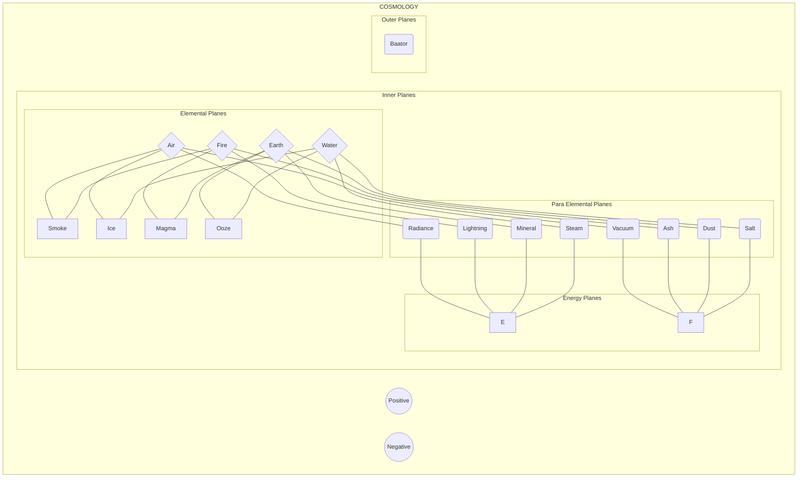
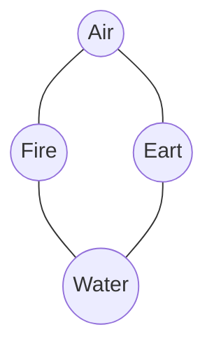

---
{"dg-publish":true,"permalink":"/places/cosmology/planes-of-existance/mermaid/","dgHomeLink":true,"dgPassFrontmatter":true}
---

```mermaid
graph TD
subgraph COSMOLOGY

	%%Objects
	A{Air}
	B{Fire}
	C{Earth}
	D{Water}

	pos((Positive))
	neg((Negative))

	G[Smoke]
	H[Magma]
	I[Ooze]
	J[Ice]

	K(Radiance)
	L(Lightning)
	M(Mineral)
	N(Steam)
	
	O(Vacuum)
	P(Ash)
	Q(Dust)
	R(Salt)


	%%Links
	subgraph Inner Planes
		subgraph Elemental Planes
			A --- G & J
			B --- H & G
			C --- I & H
			D --- J & I

			%%A --- G --- B
			%%B --- H --- C
			%%C --- I --- D
			%%D --- J --- A
		end
		subgraph Para Elemental Planes
			direction RL
			A --- K
			B --- L
			C --- M
			D --- N
			A --- O
			B --- P
			C --- Q
			D --- R
		end
		subgraph Energy Planes
			K & L & M & N --- E
			O & P & Q & R --- F
		end
	end
	
	subgraph Outer Planes
		Z(Baator)
	end
end

class A,B,C,D,E,F,G,H,I,J,K,L,M,N,O,P,Q,R,S,T,U,V,W,X,Y,Z internal-link;
```

```mermaid
flowchart TD
A((Air))
B((Fire))
C((Eart))
D((Water))

A --- B & C --- D
```

